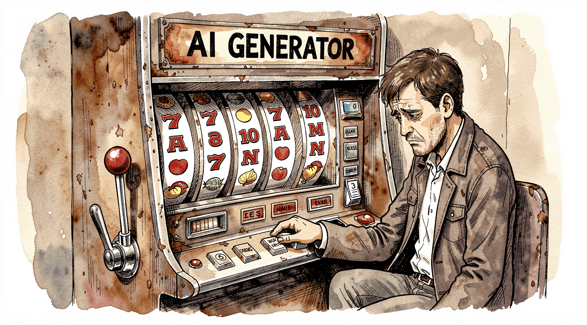
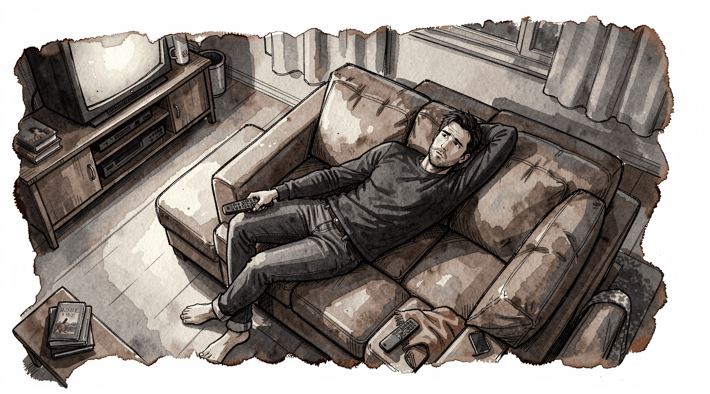

We thought AI was going to make life easier, giving us time back by automating
away the monotonous work. But just like the Industrial Revolution, factory
automation, and robots didn't lead to giving workers a life of ease and luxury,
knowledge work automation through agentic and generative AI is no Caribbean
vacation; it tends to leave us with dopamine "crashes" and mental fatigue. Both
of those lead to increased brain fog, exhaustion, and irritability.

Before we go any further, let me preface what follows with the caveat that I do
not consider myself a neuroscience enthusiast, let alone a professional. This is
my rudimentary understanding, and it is likely missing nuance or is simply
incorrect. If you have more experience in this field than me, and you find my
explanations lacking, please [send me an email][email] and I will update this
post accordingly.

When you click the button to send off the generative AI to go do its work, it's
a little bit like pulling the lever of a slot machine. What you get out of it
could be terrible, or it could be great. Life changing, even. More often than
not, it's just good enough that we feel like we are winning: The report numbers
are crunched, the software is written, the email is polished, the artwork is
generated—in quantities far beyond what we could previously accomplish. But
there is a cost. We pull the lever, getting close to what we really want, but
never quite reaching the peak of excellence. It’s good enough that we go back
for more, but not satisfying enough to get us to quit. And so we pull the lever
again, and again, and again.

<figcaption markdown="span">
  Generative AI work is a lot like a slot machine—sometimes you hit it big.
</figcaption>

My understanding is that this is called a variable reward schedule[^1]. After a
prolonged period of operating in this mode, our brains calibrate themselves to
this, and the rewards for normal routine activities are dull by comparison.
Irritability, exhaustion, lack of motivation, and poor or impulsive
decision-making set in, and it takes time to recharge and let our brains
calibrate back to normal before we can be decent human beings again.

[email]: mailto:<%= site_config.email %>?subject=Re:%20<%=
Addressable::URI.encode(@item[:title]) %>

[^1]:
    B. F. Skinner showed that when rewards come after an unpredictable number of
    tries (he called it a
    [variable ratio schedule](https://en.wikipedia.org/wiki/B._F._Skinner#Schedules_of_reinforcement)),
    people keep going much longer. Because the next reward might come at any
    time, it encourages repeated behavior. This is why slot machines, doom
    scrolling, social media reactions, and now generative AI are so addicting.
    This is different from the variable interval schedule, which is time-based.
    Because the number of tries is proportional to the number of rewards—albeit
    variably—the variable ratio schedule is much more likely to increase
    engagement.

A related second problem is simply mental fatigue. When you make a series of
high-impact decisions, perform qualitative analysis on a large volume of
content[^2], or attempt to multitask[^3], it has a similar effect, at least in
my experience. I know less about the biological and psychological mechanisms on
this one, but they’re real.

[^2]:
    John Sweller's Cognitive Load Theory, developed in the 1980s, is helpful
    here. It's the idea that we have a limited capacity for working memory, and
    when we exceed that, it increases stress, reduces learning, and our
    attention fragments. It's the same reason a small code change is easier to
    review than a large one. Generative and agentic AI defaults to producing
    large changes. There are probably ways that we can tune our context so that
    the models return smaller changes at a time, but then we drift further into
    rapid task switching (see [footnote #3](#fn:3)) and reduce our overall
    productivity.

[^3]:
    Psychologists generally distinguish true multitasking from rapid task
    switching. When people switch back and forth between tasks, performance
    slows and errors tend to increase because the brain has to reorient each
    time rather than doing both demanding tasks at once. Furthermore, while the
    research is still in the early stages, there are indications that the
    [negative long-term effects include weakened memory, reduced concentration
    and increased anxiety][hasan].

[hasan]: https://pmc.ncbi.nlm.nih.gov/articles/PMC11543232/

AI work involves all of these leading causes of mental fatigue. Entrepreneur and
software engineer Steve Yegge, in his widely circulated Medium post,
[The AI Vampire](https://steve-yegge.medium.com/the-ai-vampire-eda6e4f07163),
writes:

> I’ve argued that AI has turned us all into Jeff Bezos, by automating the easy
> work, and leaving us with all the difficult decisions, summaries, and
> problem-solving. I find that I am only really comfortable working at that pace
> for short bursts of a few hours once or occasionally twice a day, even with
> lots of practice. ... I’m convinced that 3 to 4 hours is going to be the sweet
> spot for the new workday. ... Assume that exhaustion is the norm. Building
> things with AI takes a lot of human energy.

Because we automate the busy work, it doesn’t give our brains time to recharge
from the fatigue. Furthermore, we’re constantly switching from task to task as
our agents happily work away. I’m currently learning how to protect that energy
and keep some reserve in the tank for my family during evenings and weekends.

You could try to sustain your multiplied output at full capacity and end up
disconnected from reality, exhausted, angry, and unhappy. I’ve recently been
filling my evenings with LLM conversations, music generation, and vibe-coded
side projects only to yell at my kids and say rude things to my wife because my
brain is too tapped out to be compassionate.

<figcaption span="markdown">
  Too tapped out to be compassionate.
</figcaption>

We have to find the right balance between productivity and rest—both at work and
at home. We can't go full bore at work and then expect to be able to have the
energy and motivation to accomplish the things we need to get done at home. What
is that balance? It obviously will be different for everyone. But we have to be
intentional about it. We can't just let it happen to us, or we'll burn out and
be left with nothing.
