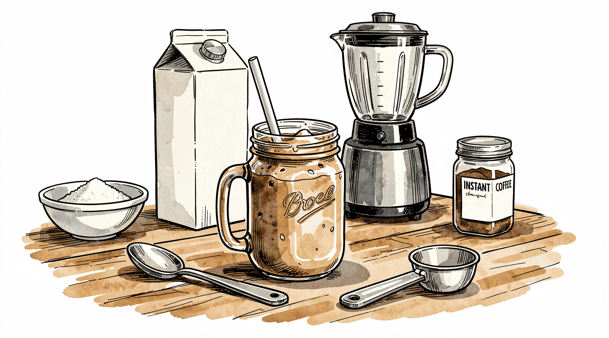

Do you like Frappucino&reg;s[^1] from Starbucks? Do you _not_ like how expensive
they are? Here's a recipe for a tasty blended coffee treat that costs less than
50¢ to make:

- 1 cup milk
- 5 tbsp sugar
- 1 tbsp instant coffee
- 1 cup ice

Blend and enjoy!

[^1]:
    **Frappuccino&reg;** is a registered trademark of **Starbucks Corporation.**
    This site is not affiliated with, endorsed by, or sponsored by Starbucks
    Corporation.
