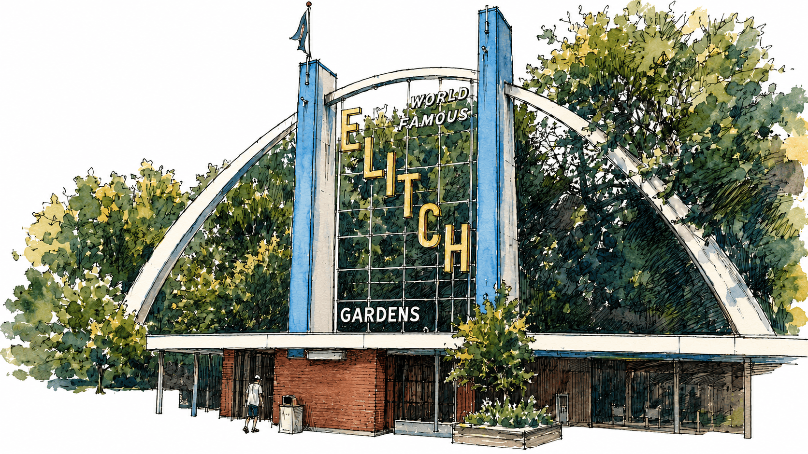
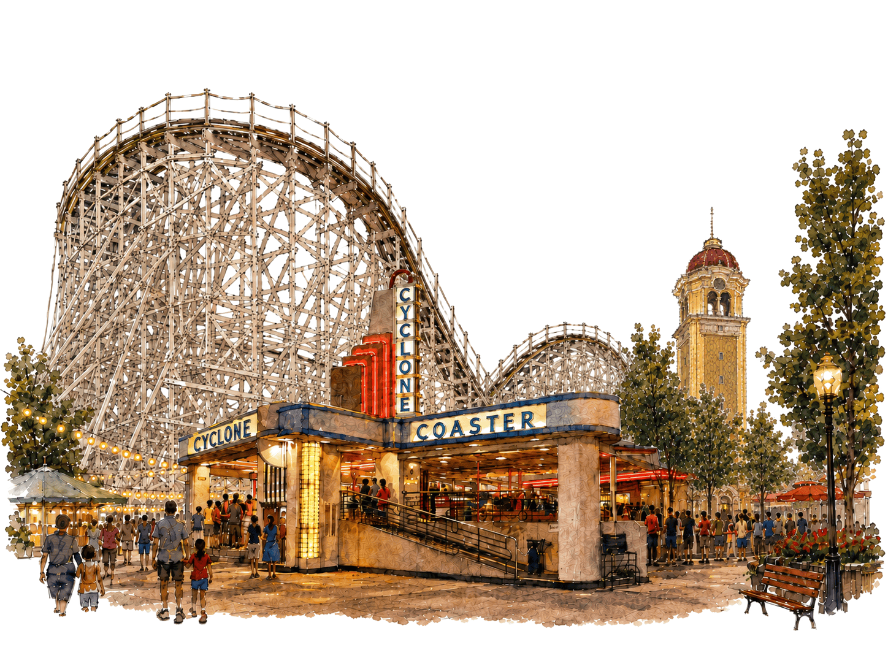

Growing up in Denver, you had the choice between two amusement parks: Elitch's
or Lakeside, and they were literally in the same neighborhood. The official name
was Elitch Gardens, even though we all just called it "Elitch’s," including the
park itself ("Not to See Elitch's is Not to See Denver"). I ran across this
[awesome archival footage][elitchs-video] that captured the original park in all
its glory during its final days of operation (much of which I'd all but
forgotten about, like the gondola that took you right over the Sidewinder
track). Elitch's was where you went when you had a little more money to burn,
because even though it was more expensive, it was clearly the better park: two
wooden coasters, a launch loop coaster, plenty of other rides for the whole
family, great entertainment, and beautiful gardens.

<figcaption markdown="span">
  Elitch's was more expensive, so I rarely got to see these entrance gates.
</figcaption>

[elitchs-video]: https://www.youtube.com/watch?v=aoMUwP-KkJ0

Lakeside, on the other hand, had (and still has, thankfully!) some cool Art Deco
elements, especially on the ride entrance signage. The original entrance, "Tower
of Jewels," loomed over Sheridan Boulevard and beckoned you to pass through the
gate. Lakeside was a blast from the past; a living relic of a bygone era. I got
my first taste of the adrenaline riding the kiddie coaster 27 times in a row as
a toddler, and the next year I began riding the Cyclone: a wonderful—albeit
short—wooden coaster that gives a wonderful vista of Lake Rhoda as you careen
over the hills and curves. Cyclone is the last standing coaster by designer
Edward Vettel, but it has not been in operation since 2022 due to an ongoing
lawsuit.

<figcaption markdown="span">
  The vintage Art Deco entrance gate to Cyclone with the Tower of Jewels in the background.
</figcaption>

By the time of my childhood in the 80s and 90s, however, Lakeside was already
inching past its prime and suffered from a lack of vision and maintenance. Rides
began to break down, and the "new" rides they began adding were simply portable
carnival rides with lackluster theming. There were no shows, or any kind of
entertainment beyond the handful of rides.

So even though I spent considerably more time exploring the park at Lakeside,
when my parents' wallets allowed the choice, I chose Elitch's. And then, in a
move that baffled my parents and made the midsummer sun on park days more
excruciating, in 1995 they moved from a a beautiful park full of history and
mature trees to the shadeless concrete jungle just west of Downtown
Denver.[^location] But it all turned out to be worth it for 11-year-old me with
the opening of the first inverted coaster within hundreds of miles, Mind Eraser
(the 10th installation of a standard Vekoma SLC replicated in many parks around
the globe). I rode that thing more times than I can count, and I had every
twist, roll, and inversion memorized. Twister II was a painful and rather boring
wooden coaster, and I missed the shorter, rollicking Wildcat.[^wildcat] I didn't
care about theming, but I didn't _know_ that I didn't care about theming.

[^location]:
    I learned that Elitch Gardens is supposed to leave downtown due to the
    [River Mile redevelopment project][rivermile], and will either shut down
    completely, leaving Denver without any major parks, or will have to move. As
    of this writing, nothing official has been announced, but rumors indicate
    2026 might be the last year for this 136-year-old park. But that effort
    seems to be on pause, so Elitch's will continue to operate in its current
    location until it is forced to vacate.

<!-- prettier-ignore -->
[rivermile]: https://5280.com/inside-one-of-the-largest-redevelopments-in-denvers-history/

[^wildcat]:
    Here's a [10-minute YouTube video][pov-coasters] that features front-seat
    POV footage of both Wildcat and the original Mister Twister at Elitch
    Gardens. The narrator claims that Wildcat had enough negative G-forces that
    it actually lifts off the track on the hills.

[pov-coasters]: https://www.youtube.com/watch?v=lo7RqOq634c

Both of these parks carry historical significance. I greatly admire Lakeside for
staying in the original location, and I think Elitch Gardens lost something
wonderful in the move. But it's probably not worth making a trip to Denver just
for that. But if you're already in town, maybe stop in for a while, and try
imagine a vibrant park full of life and activity, the familiar roar of a roller
coaster, and the excited chatter of families as they race from ride to ride.
